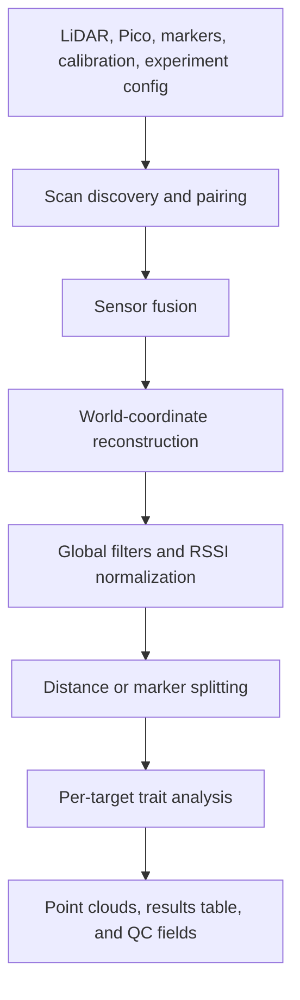

# LiDAR Analysis Pipeline

**A configurable Python pipeline that fuses field LiDAR, encoder, IMU, marker, and calibration data into reconstructed crop point clouds and per-target phenotype tables.**

The system supports researchers running field experiments and developers extending the reconstruction workflow. It can process one experiment/date locally or participate in higher-level staging, packaging, and publishing workflows.

## Why It Exists

Raw cart data arrives as multiple synchronized streams rather than an analysis-ready point cloud. This pipeline owns the transformation from those sensor files to spatially reconstructed, target-level outputs while keeping calibration, fusion, filtering, splitting, and trait settings explicit in experiment configuration.

That separation makes it possible to compare controlled configuration variants without modifying raw project data.

## Key Capabilities

- Pair synchronized SICK multi-beam LiDAR and Pico encoder/IMU scans
- Select time-, IMU-interpolated-, or PPS-based fusion
- Reconstruct world coordinates from cart motion and calibration
- Apply configurable spatial, RSSI, local-ground, outlier, and voxel operations
- Split scans into targets by distance or field markers
- Handle scan-side conventions and two-sided scan names
- Generate per-target point-cloud CSVs and experiment-level trait tables
- Compute configurable geometry, topology, PAI, and MTA outputs
- Run scans in parallel while preserving per-target result identities
- Poll and stage mounted research data through separate watcher/orchestrator paths

## Pipeline Architecture



The active local entry point is `lidar_analysis.central_runner`. It builds an `AnalysisConfig`, pairs scan files, and calls the staged processing path into `pipeline_core.process_scan`.

See [Overview](docs/OVERVIEW.md) and [Code Walkthrough](docs/CODE_WALKTHROUGH.md) for the full call path and module boundaries.

## Inputs and Outputs

### Inputs

| Input | Purpose |
| --- | --- |
| `*_lidar.csv` | LiDAR timestamps, angles, distance, RSSI, and PPS values |
| `*_pico.csv` | Encoder counts, IMU orientation, timestamps, and PPS values |
| Marker CSVs | Optional field reference points for plot/plant splitting |
| `cart_config.yaml` | Cart identity and calibration |
| Experiment YAML | Fusion, filtering, splitting, trait, and output settings |

### Outputs

| Output | Purpose |
| --- | --- |
| `OUTPUT_DIR/results.csv` | Canonical per-target trait and QC rows |
| `OUTPUT_DIR/pointclouds/*.csv` | Reconstructed point clouds with `X`, `Y`, `Z`, `RSSI`, and optional scalar fields |
| Marker reference CSV | Optional exported field markers |
| Topology object CSVs | Optional per-target topology outputs |

## Coordinate System

The repository-wide convention is:

| Axis | Meaning |
| --- | --- |
| `X` | Left/right across the crop row |
| `Y` | Vertical height |
| `Z` | Travel direction along the row |

Point-cloud coordinates are written in meters. Some internal calculations use millimeters.

## Tech Stack

- Python
- NumPy, pandas, and SciPy
- PyYAML experiment and cart configuration
- pytest
- CSV point-cloud and trait outputs
- Optional matplotlib helpers and CloudCompare validation

## Getting Started

Install the current dependencies:

```bash
python3 -m pip install -r requirements.txt
```

Run one experiment/date:

```bash
python3 -m lidar_analysis.central_runner \
  --experiment EXPERIMENT_NAME \
  --date DATE_NAME \
  --input INPUT_DIR \
  --working WORKING_DIR \
  --output OUTPUT_DIR \
  --config CONFIG_YAML
```

Expected input layout:

```text
INPUT_DIR/
├── cart_config.yaml
├── experiment_config.yaml
├── <scan_id>_lidar.csv
├── <scan_id>_pico.csv
└── markers/
    └── <scan_id>_markers.csv
```

The experiment config may live outside the data directory and be supplied with `--config`. This is useful for controlled experiment variants because it keeps raw project data unchanged.

See [Running the Pipeline](docs/RUNNING_THE_PIPELINE.md) for path resolution, success criteria, watcher/orchestrator workflows, and troubleshooting.

## Example Data Limitation

The small fixture in `lidar_analysis/example_data/2026_04_28_1/` includes LiDAR, Pico, and marker CSVs, but not the required `cart_config.yaml` or an experiment config. Do not treat it as a standalone end-to-end demo until those inputs are supplied.

## Testing and Validation

Run the automated suite without writing bytecode or pytest cache artifacts:

```bash
PYTHONDONTWRITEBYTECODE=1 python3 -m pytest -q -p no:cacheprovider tests
```

Run the repository-required syntax check:

```bash
python3 -m py_compile lidar_analysis/*.py
```

Validation is deliberately both automated and visual:

1. Use a unique output directory for each configuration variant.
2. Compare `results.csv` fields and point counts.
3. Inspect the corresponding point clouds in CloudCompare.
4. Record the command, config, output path, result fields, and visual observations.

See [Testing and Validation](docs/TESTING_AND_VALIDATION.md) for the controlled experiment matrix.

## Important Modules

| Module | Responsibility |
| --- | --- |
| `central_runner.py` | Local command-line entry point and experiment/date execution |
| `pipeline_stages.py` | Staged processing boundary |
| `pipeline_core.py` | Reconstruction, filtering, splitting, analysis, and output |
| `fusion.py` | Time-based sensor fusion |
| `fusion_imu_interp.py` | IMU-timestamp interpolation |
| `fusion_pps.py` | PPS-aligned fusion |
| `mark_splitting.py` | Marker-aware target boundaries |
| `config.py` | Analysis configuration contract |
| `central_watcher.py` | Mounted-data polling and rerun workflow |
| `orchestrator.py` | Staging, execution, packaging, and optional publishing |
| `topology/` | Optional topology and trait helpers |

## Documentation

- [Overview](docs/OVERVIEW.md)
- [Running the Pipeline](docs/RUNNING_THE_PIPELINE.md)
- [Configuration](docs/CONFIGURATION.md)
- [Testing and Validation](docs/TESTING_AND_VALIDATION.md)
- [Code Walkthrough](docs/CODE_WALKTHROUGH.md)
- [Scan Naming](docs/SCAN_NAMING.md)
- [Result Schema](docs/RESULT_SCHEMA.md)
- [Plot-Bounded MTA](docs/PLOT_BOUNDED_MTA.md)
- [CloudCompare Workflow](docs/CLOUDCOMPARE.md)
- [Troubleshooting](docs/TROUBLESHOOTING.md)

## Project Status

The central runner, watcher, sensor-fusion paths, reconstruction, filtering, target splitting, result schemas, bounded PAI/MTA analysis, and automated tests are present in the repository.

Dependencies are intentionally unpinned because the research team has not yet approved a locked environment. A validated lockfile or environment definition remains an important reproducibility improvement.
