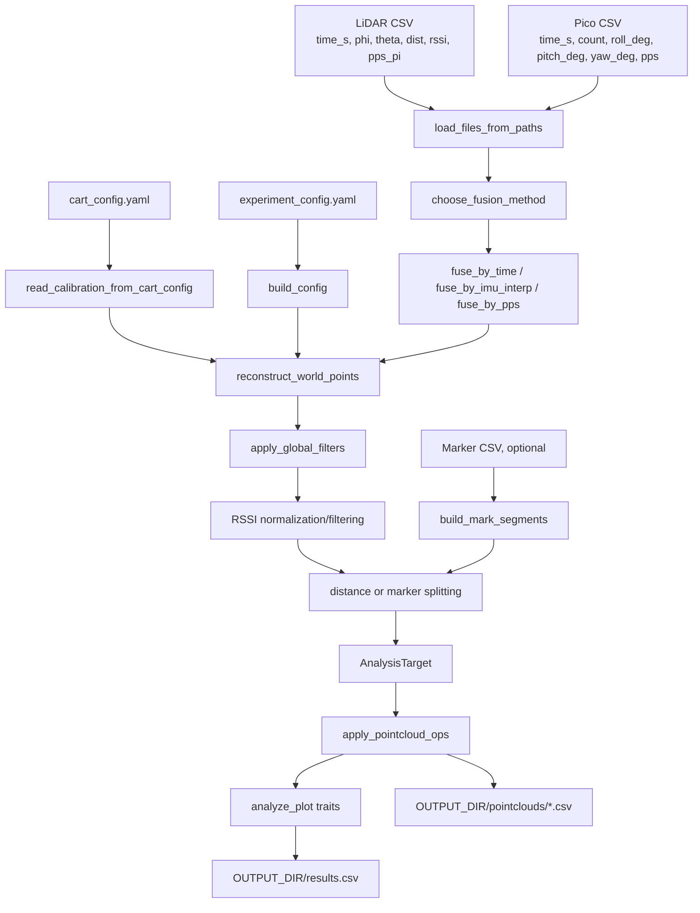

# LiDAR Analysis Repository Overview

This repository contains a Python scientific computing pipeline for a field LiDAR phenotyping cart. The repository evidence for this is in `README.md`, `AGENTS.md`, and the active processing code in `lidar_analysis/central_runner.py` and `lidar_analysis/pipeline_core.py`.

The pipeline combines synchronized SICK LiDAR scans, Pico encoder/IMU logs, cart calibration, optional marker files, and experiment configuration to reconstruct point clouds and calculate per-plot or per-plant traits.

## Coordinate System

The coordinate convention is stated in `README.md` and `AGENTS.md`, and the reconstruction code follows it in `lidar_analysis/pipeline_core.py::reconstruct_world_points`.

| Axis | Meaning |
| --- | --- |
| `X` | left/right across the row |
| `Y` | vertical height |
| `Z` | travel direction along the row |

Do not change this convention. Many filters and CloudCompare import steps assume the output point-cloud CSV columns are `X`, `Y`, and `Z`.

## Main Inputs

### LiDAR CSV

Read by `lidar_analysis/pipeline_core.py::load_files_from_paths`.

Required columns:

```text
time_s, phi, theta, dist, rssi, pps_pi
```

These are loaded as NumPy arrays and passed into a fusion method.

### Pico Encoder / IMU CSV

Read by `lidar_analysis/pipeline_core.py::load_files_from_paths`.

Required columns:

```text
time_s, count, roll_deg, pitch_deg, yaw_deg, pps
```

Optional column:

```text
imu_time_s
```

`imu_time_s` is used by `lidar_analysis/fusion_imu_interp.py::fuse_by_imu_interp` and `lidar_analysis/fusion_pps.py::fuse_by_pps` when present and meaningfully different from `time_s`.

### Marker CSV

Used only when marker splitting is enabled. Marker handling is implemented in `lidar_analysis/mark_splitting.py`.

Required columns, from `lidar_analysis/mark_splitting.py::_load_markers`:

```text
target_type, target_number, mark_role, encoder_count
```

Optional sorting columns:

```text
marker_idx
time_s
```

The example marker file is:

```text
lidar_analysis/example_data/2026_04_28_1/markers/2&1_1_20_multi02_2026_04_28_1_Vetch_PDS_2026_marker.csv
```

### Cart Calibration YAML

The active runner requires a file named:

```text
cart_config.yaml
```

at the input directory root. This requirement is enforced by `lidar_analysis/central_runner.py::run_experiment_date`.

`lidar_analysis/central_runner.py::read_calibration_from_cart_config` reads:

| Calibration value | Accepted location in YAML |
| --- | --- |
| cart ID | `cart_id`, `cart`, or `hostname` |
| encoder scale | `m_per_click` or `encoder.m_per_click` |
| LiDAR height | `lidar_height_m` or `lidar.height_m` |
| LiDAR wheel offset | `lidar_wheel_offset_m` or `lidar.lidar_wheel_offset_m` |
| IMU offset | `imu_offset_m.{dx,dy,dz}` or `imu.offset_m.{dx,dy,dz}` |
| tilt bias | `tilt_bias_deg.{roll_offset_deg,pitch_offset_deg}` or `imu.tilt_bias_deg.{roll_offset_deg,pitch_offset_deg}` |

Important: the repository does not include an example `cart_config.yaml` in `lidar_analysis/example_data/2026_04_28_1`.

### Experiment Config YAML

The runner loads an experiment config from:

- `--config CFG`, if supplied.
- `input_dir/experiment_config.yaml`.
- `input_dir/source/experiment_config.yaml`.

This behavior is implemented in `lidar_analysis/central_runner.py::resolve_config_path`.

If the config has an `analysis` mapping, `lidar_analysis/central_runner.py::extract_analysis_cfg` uses that mapping. Otherwise it treats the top-level config as the analysis config.

## Main Outputs

### Point-Cloud CSVs

Written by `lidar_analysis/pipeline_core.py::Plot.write`, usually through `lidar_analysis/pipeline_core.py::write_scan_outputs`.

The active runner writes point clouds under:

```text
OUTPUT_DIR/pointclouds/
```

from `lidar_analysis/central_runner.py::run_experiment_date`.

Typical point-cloud columns come from `lidar_analysis/pipeline_core.py::analyze_plot`:

```text
X, Y, Z, RSSI, source_index, time_s, phi, theta, dist_mm, range_m,
encoder, roll_deg, pitch_deg, yaw_deg, beam_id
```

If RSSI normalization is enabled, `rssi_norm` is added by `lidar_analysis/pipeline_core.py::apply_rssi_normalization_after_masks`. If point-cloud operations create additional scalar columns, `Plot.write` preserves them because it writes all columns from `AnalysisTarget.current_points`.

`Plot.write` converts `X`, `Y`, and `Z` from millimeters to meters before writing CSV.

### Results / Trait CSV

The active runner writes:

```text
OUTPUT_DIR/results.csv
```

Created by `lidar_analysis/central_runner.py::ensure_results_csv` and appended by `lidar_analysis/central_runner.py::append_trait_rows`.

The exact columns are controlled by `lidar_analysis/central_runner.py::phenotype_columns`. Columns can include:

- `experiment`
- `date`
- `scan_id`
- `row`
- `plot`
- `height_m`
- `lai_even`
- `lai_uneven`
- `point_density_m2`
- `plot_length_m`
- `plot_width_m`
- `stand_topo_per_m`
- `voxel_count`
- `points`
- `lidar_scans`
- `lidar_angles`

Some columns only appear when config options or point-cloud operations are enabled.

### Metadata Files

The active `central_runner` path does not write a metadata directory by itself.

Metadata appears in the orchestration layers:

- `lidar_analysis/orchestrator.py` packages files into `pointclouds`, `results`, and `scan_metadata` in `build_output_package`.
- `lidar_analysis/central_watcher.py` writes metadata files such as `scan_metadata/state.yaml`, `scan_metadata/process.log`, `scan_metadata/experiment_config.snapshot.yaml`, and `scan_metadata/cart_config.snapshot.yaml`.

## Plain-English Pipeline

1. Find matching LiDAR and Pico CSV files.
2. Load LiDAR beams and Pico encoder/IMU rows.
3. Fuse LiDAR rows with encoder and IMU values using time interpolation, IMU timestamp interpolation, or PPS alignment.
4. Convert polar LiDAR beams into Cartesian points.
5. Use encoder counts to place points along travel direction `Z`.
6. Optionally apply IMU roll/pitch/yaw correction.
7. Apply global masks such as row width, minimum X distance, maximum Y height, minimum radius, RSSI normalization, and RSSI filtering.
8. Split the scan into plots or plants by distance or marker windows.
9. Build an `AnalysisTarget` for each plot/plant.
10. Apply ordered point-cloud operations from config, if any.
11. Compute traits such as height, LAI, density, voxel count, topology, or slice structure when enabled.
12. Write point-cloud CSVs and `results.csv`.

## Data-Flow Diagram



